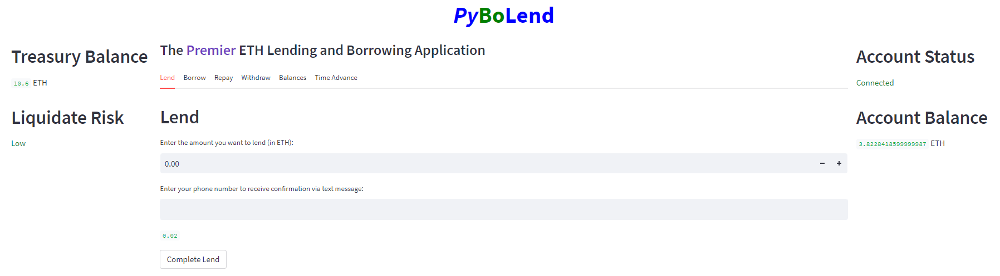
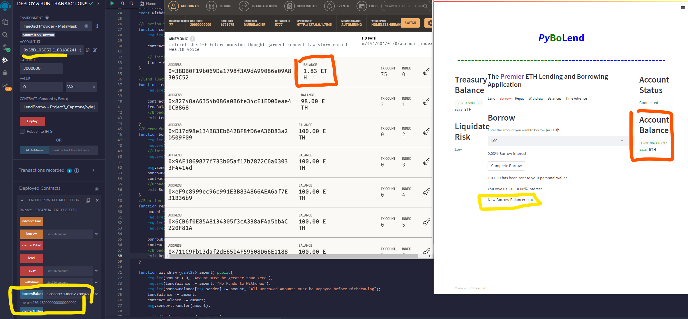

# PyBo Lend - A DeFi App Built Using Solidity and Python

## Table of Contents

1. [Project Concept](#Project-Concept)
1. [Features](#Features)
1. [Test Cases](#Test-Cases)
1. [Code Dependencies](#Project-Team)
1. [Contribution Guidelines](#Contribution-Guidelines)
1. [Contact](#Contact)
1. [License](#License)

## Project Concept
The goal of this project is to create a decentralized lending application utilizing a Solidity smart contract and a user interface coded in Python. The core features of the Solidity smart contract are lending, borrowing, repaying debts, and withdrawing funds. Since the smart contract is coded in Solidity, the asset being lent and borrowed is Ether from the Ethereum test network. Although the test cases compiled for this project do not involve real money, it functions as a proof of concept for a zero custody lending application that could be deployed on the Ethereum network.


[Repo Link](https://github.com/Olegreg762/Group_Project_3) <br>


## Features
The core features of the PyBoLend App include: 
- Lending
- Borrowing
- Repaying
- Withdrawing
- Accruing interest

Since this is a decentralized Ethereum application with a python UI, the core functionality spans two key files 1) `pylend.sol` and 2) `lend_borrow.py`. In the following sub-sections, we outline the solidity code first then the python code that governs the given feature functionality.

### Lending
Lending functionality is coded across two core files: `pylend.sol`, `lend_borrow.py`. The initial implementation is in the smart contract below. After deploying an instance of the contract, a user is able to submit ETH to the contact in the form of a loan, the contractBalance gets updated with the value sent, then the lendBalance is updated, and finally the Lending event is broadcast to the blockchain.

```solidity
function lend() public payable{
    require(msg.value > 0, "Amount must be greater than zero");
    contractBalance += msg.value;
    lendBalance += msg.value;
    //Broadcast the Lend
    emit Lend(msg.sender, msg.value);
```

The user's interaction with the contract occurs on lend_borrow.py. If the "Complete Lend" button is clicked, the amount input by the user is converted to wei. Then the lend transaction from the solidity contract is saved to the variable `lend`. Then the users credit to the treasury is saved as to the variable `lend_balance` by calling the `lendBalance()` solidity function and this variable is returned.

```python
    lend_amount = amount
    lend_amount_wei = Web3.toWei(lend_amount*10**18, 'wei')
    lend = contract.functions.lend().transact({'value': lend_amount_wei,'from': w3.eth.accounts[0]})
    lend_balance = contract.functions.lendBalance().call()
    return lend_balance
```


### Borrowing
The initial implementation of borrowing is in the smart contract on the `pylend.sol` smart contract. Before a borrow transaction can be executed certain requirements are verified in the code above. Including limiting what a user can borrow to 80% of the total amount they have already loaned. The amount gets transferred to the user, their contract balance is updated (and a corresponding amount from the contract balance is reduced), and the event is broadcast to the network.

```solidity
function borrow(uint256 amount) public {
    require(amount > 0, "Amount must be greater than zero");
    require(lendBalance >= amount, "Borrow Amount must be less than Amount Lended");
    //Limits Borrow amount to 80% of the amount lended
    require(borrowBalance[msg.sender].add(amount) <= lendBalance.mul(8).div(10), "Borrow Amount exceeds 80% of Lend Amount");

    msg.sender.transfer(amount);
    borrowBalance[msg.sender] += amount;
    contractBalance -= amount;
    //Broadcast the Borrow
    emit Borrow(msg.sender, amount);
```

If the "Complete Borrow" button is clicked, the amount input by the user is converted to wei. Then the lend transaction from the solidity contract is saved to the variable `borrow`. Then the users debt to the treasury is saved as to the variable `borrow_balance` by calling the `borrowBalance()` solidity function and this variable is returned.

```python
    borrow_amount = amount
    borrow_amount_wei = Web3.toWei(borrow_amount*10**18, 'wei')
    borrow = contract.functions.borrow(borrow_amount_wei).transact({'from': w3.eth.accounts[0]})
    borrow_balance = contract.functions.borrowBalance(user_account).call()
    return borrow_balance
```


### Repay
The initial implementation is in the smart contract on the `pylend.sol` smart contract. Before a user can repay their loan, certain requirements are verified. Their borrow balance is then reduced by the amount repaid (and the contractBalance increased accordingly).

```solidity
function repay(uint256 amount) public payable {
    amount = msg.value;
    require(amount > 0, "Amount must be greater than zero");
    require(amount <= borrowBalance[msg.sender], "Repay must be less than amount borrrowed");
    require(borrowBalance[msg.sender] >= 0, "No Borrow Amount to Repay");

    borrowBalance[msg.sender] -= amount;
    contractBalance += amount;
    //Broadcast the Repay amount
```

If the "Complete Repay" button is clicked, the amount input by the user is converted to wei. Then the repayment transaction from the solidity contract is saved to the variable `repay`. Then the users debt to the treasury is updated by calling the `borrowBalance()` solidity function and saved as to the variable `new_borrow_balance`, which is then returned to be displayed to the user interface.

```python
    repay_amount = amount
    repay_amount_wei = Web3.toWei(repay_amount*10**18, 'wei')
    repay = contract.functions.repay(repay_amount_wei).transact({'value': repay_amount_wei, 'from': w3.eth.accounts[0]})
    new_borrow_balance = contract.functions.borrowBalance(user_account).call()
    return new_borrow_balance
```


### Withdraw Balance
The initial implementation is in the smart contract on the `pylend.sol` smart contract. Before a user can withdraw, certain requirements are verified. Then the lendBalance and contractBalance and both reduced by the amount withdrawn. The transfer to the user is executed, and the event is broadcast to the blockchain. 

```solidity
function withdraw (uint256 amount) public{
    require(amount > 0, "Amount must be greater than zero");
    require(lendBalance >= amount, "No Funds to Withdraw");
    require(borrowBalance[msg.sender] <= amount, "All Borrowed Amounts must be Repayed before Withdrawing");
    lendBalance -= amount;
    contractBalance -= amount;
    msg.sender.transfer(amount);

    emit Withdraw(msg.sender, amount);
```

The user is able to withdraw their balance by interact with the contract over streamlit interface coded in the lend_borrw.py file. When the solidity_function is called with the withdraw parameter, the amount parameter is saved as the withdraw_amount. This amount is then converted into wei. Then the solidity contract function `withdraw` is called, passing the withdraw_amount_wei as a parameter, and executing the transaction with the web3 library. Lastly the borrowBalance is updated and saved in the withdraw_balance variable.

```python
    withdraw_amount = amount
    withdraw_amount_wei = Web3.toWei(withdraw_amount*10**18, 'wei')
    withdraw = contract.functions.withdraw(withdraw_amount_wei).transact({'from': w3.eth.accounts[0]})
    withdraw_balance = contract.functions.borrowBalance(user_account).call()
```


### Interest Rate Calculation
Interest functionality is coded in `Interest_rate.py`, imported into `lend_borrow.py`, then then sent over to the `pylend.sol` smart contract. The `Interest_rate.py` files defines three funtioons.

The `utilization_rate()` function takes two parameters, the `contract_balance` and `contract_lend`. Based on these two parameters, it then calculates the utilization rate by amount lent by the contract balance. This figure is then returned for future use. Additionally it returns a boolean value called `over_borrow` that is used in the interest rate calculation.

```python
def utilization_rate(contract_balance, contract_lend):

    # sets default rate if the function errors out
    util_rate = .5
    over_borrow = False

    # tests contract balance and calculates Util rate

    if contract_balance>= 0 and contract_balance>contract_lend:
        util_rate = contract_lend/contract_balance
    elif contract_balance >= 0 and contract_balance < contract_lend:
        over_borrow = True
    return over_borrow, util_rate
```

The next function defined in `Interest_rate.py` is actual interest rate calculation. First a default rate is set by multiplying the base rate by `slope1`. Then the function checks to see if the `over_borrow` status is True of False to determine the optimal interest calculation. Af the utilization rate is above or below the optimal level, different interest rates are determined. These dynamic calculations work to incentivize or disincentivize lending and borrowing accordingly.

```python
def interest_rate(util_rate ,util_optimal, base_rate, slope1, slope2, over_borrow):
    
    #sets default rate 
    i_rate = base_rate + slope1
    
    # Test if there is an over-borrow situation
    if over_borrow == False:

        # if the utilization rate is less than the optimal rate
        if util_rate<= util_optimal:
            i_rate = base_rate + slope1*(util_rate/util_optimal)

        # if the utilization rate is greater than the optimal rate    
        elif util_rate >util_optimal:
            i_rate = base_rate +slope1 +slope2*((util_rate -util_optimal)/(1-util_optimal))
    
    # sets the intrest if the over borrow is high
    elif over_borrow == True:
        i_rate = i_rate + slope1 + slope2*100

    return i_rate
```

The final function then sends the interest calculated to the smart contract so the user can be credited or debited accordingly. 

### Notifications
PyBoLend allows for users to received confirmation via SMS text message after a successful lending transaction. This functionality is coded in a file called `notification_manager.py`, which uses an API provided by Twilio to send the messages. A function called `send_notification()` is coded below:

```python
def send_notification(message, user_number):
    # saves .env variables
    twilio_number = os.getenv("VIRTUAL_TWILIO_NUMBER")
    twilio_sid = os.getenv("TWILIO_SID")
    twilio_auth_token = os.getenv("TWILIO_AUTH_TOKEN")    

    # initializes client object
    client = Client(twilio_sid, twilio_auth_token)

    # creates and send notification message
    message = client.messages.create(
        body=message,
        from_=twilio_number,
        to=user_number
    )
```

This function takes a message and the user provided telephone number as parameters. After the required environment variables are then loaded and saved, the function creates an instance of the `Client()` object, and save it to the `client` variable. And in the last five lines the notification message is constructed and sent.


## Test Cases
In this section we provide screenshots as documentation of the successful functioning of PyBoLend.

A customer successfully executes the lending of 10 ETH:
- 

If a customer opts in, they can also receive a text that confirms their successful lending transaction.
- { width=200}

A different customer successfully executes a borrowing transaction of 1 ETH:
- 

Customers have the ability to check their balances:
- 

The following screenshot shows the customer whose balances we just saw both earning and owing interest. Their lend and borrow balances accrue interest as we simulate the advancing of time:
- 

PyBoLend is programmed with a smart contract that ensures all loans are over collateralized. A borrower is allowed to borrow up to 80% fo the ETH the have loaned. The following screenshot shows what happens when a borrow attempts to exceed this limit:
- 

## Code and Dependencies
This code is to be run on 
`Python 3.7.13`

The following Python Libraries were also imported and used

### Imports
```python
import pandas as pd
import numpy as np
import os
import requests
from dotenv import load_dotenv
from bip44 import Wallet
from web3 import Account
from web3 import middleware
from web3.gas_strategies.time_based import medium_gas_price_strategy
from mnemonic import Mnemonic
from lend_borrow import load_contract
import streamlit as st
from dataclasses import dataclass
import yfinance as yf
from web3 import Web3
import time
from pathlib import Path
import json
```

## Instructions

1. Clone the repository to your local device 
2. Download and run an instance of the Ganache as well
3. Open up remix.ethereum.org, paste the contents of the `pylend.sol` file into a new .sol file on Remix
4. After compiling the code, copy the ABI file into the `pylend_abi.json` file, and save
5. Deploy the contract. Copy the contract address, and paste into a .env file that is in the same directory as this repository on your local machine. Ensure this is saved as a string to the variable `SMART_CONTRACT_ADDRESS`
6. Run the `lend_borrow.py` file by calling the command `streamlit run lend_borrow.py`


## Project Team

[Ben Eilers](https://github.com/bweilers) <br>
[Kyle Hagan](https://github.com/hagankj) <br>
[Jose Olasa](https://github.com/joseolasa) <br>
[Greg Stevenson](https://github.com/Olegreg762) <br>

## Contribution Guidelines:

```
Feel free to contribute to this repo by creating issues or sending an email to any of the contributors in the list below.
```

## Contact

<details>
    <summary>Contact</summary>
    ben.eilers@gmail.com <br>
    kylejhagan@gmail.com <br>
    joseolasa@gmail.com <br>
    playb3yond40gb@gmail.com <br>

</details>

## License

#### Distributed under the MIT License. 
